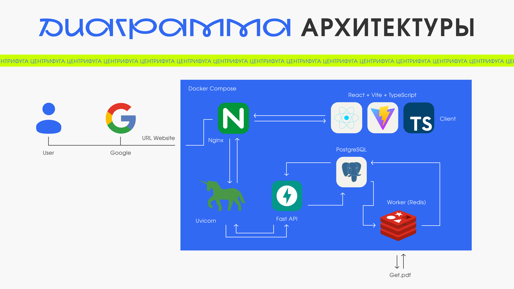
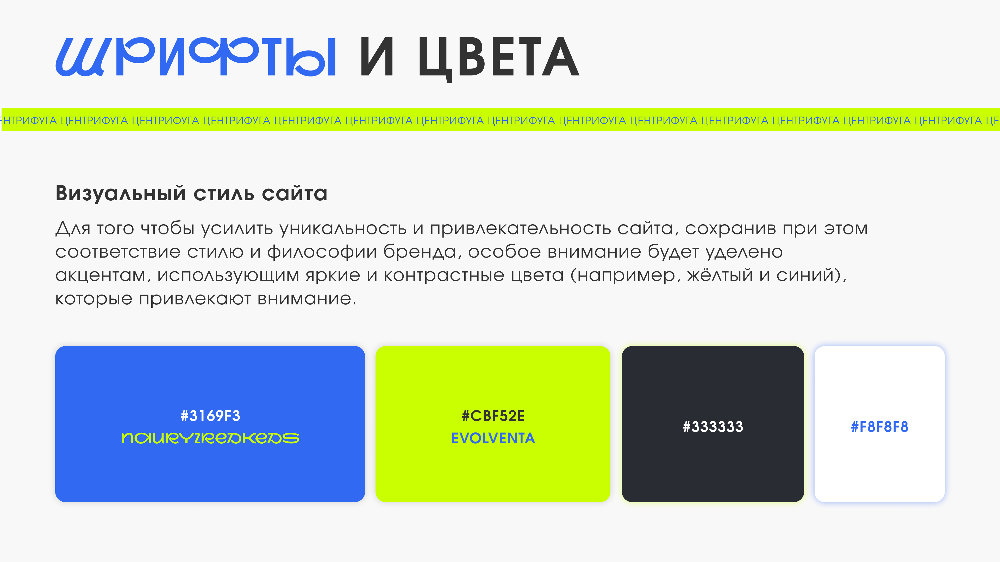

# Проект-решение: Решение Платформа к Чемпионату России по спортивному программированию в области продуктового программирования

## Проект доступен по домену: https://hackcentrifuge.ru/

## Учетные записи

**обычный пользователь** - login:user password:password
**региональный представитель** - login:region password:password
**федеральный представитель** - login:federal password:password

## 🌟 Описание проекта

**Цель проекта** – создать интуитивно-понятный и удобный календарь событий, который будет универсальным инструментом для спортсменов, их тренеров и сотрудников спортивной сферы. Мы должны собрать и представить актуальную информацию о прошедших, текущих и предстоящих событиях и соревнованиях по различным видам спорта, указанных в Едином календарном плане физкультурных мероприятий и спортивных мероприятий. Этот проект облегчит поиск информации, сделает её структурированной, также возможность фильтрации повысит скорость поиска необходимой информации.

Наша команда состоит из пяти талантливых специалистов, каждый из которых вносит свой уникальный вклад в успешную реализацию проекта. Мы объединяем опыт, креативность и технические навыки, чтобы создать что-то интереснее, функциональное и полезное.

## 👥 Участники команды

- **Никита Гилевский** – Frontend-разработчик с глубокими знаниями в React и TypeScript. Никита также работает над Telegram mini app, что расширяет область используемых полезных технологий. Также имеются навыки работы с Vite, Tanstack-Query, SCSS, Dockerfile и Feature-Sliced Design.
  
- **Герман Мирончук** – Fullstack-разработчик, который использует Vite, TypeScript, React, FastAPI Uvicorn(Base), Docker(Base) для создания надежной и функционально-наполненной серверной и клиентской части. Его страсть к программированию помогает создавать быстрые и высококачественные решения.

- **Дмитрий Бевз** – Мастер Backend-разработки, специализирующийся на FastAPI, Docker Compose и Nginx. Дмитрий обеспечивает быструю обработку данных и стабильность сервиса, что особенно важно для хранения и передачи большого количества данных.
  
- **Анастасия Прижигалинская** – Креативный дизайнер, который отвечает за визуальную составляющую проекта, отрисовывая графические решения в Figma. Анастасия создает стильный и интуитивно понятный интерфейс, который делает взаимодействие с сайтом приятным и увлекательным.

- **Дарья Яременко** – Менеджер проекта, который координирует работу команды и следит за выполнением сроков. Дарья умеет находить общий язык с каждым участником и обеспечивает гармоничное сотрудничество.

## 🚀 Этапы разработки

На каждом этапе разработки мы стремимся к совершенству. Наша команда использует современные методологии, что позволяет быстро адаптироваться к изменениям и эффективно решать возникающие задачи. Мы активно тестируем и внедряем новые функции, чтобы обеспечить пользователям лучший опыт.

## 👥 Команда

Мы верим, что успех проекта зависит от слаженной работы команды. Каждый из нас привносит свои идеи и навыки, что делает нашу работу не только продуктивной, но и увлекательной!

## 🎨 Дизайн

**Дизайн нашего продукта** можно посмотреть в [Figma], перейдя по этой ссылке: ( https://www.figma.com/design/0IBQTfg8RIHnx8gymibtEf/Окружной-Хакатон?node-id=0-1&node-type=canvas&t=aYf8wMSbkSeyWXWz-0). Мы уделили особое внимание эстетике и функциональности, чтобы сделать сайт не только красивым, но и удобным в использовании.

# Project Solution: Unified Calendar of Physical Education and Sports Events for the Russian Championship in Sports Programming in Product Programming

## 🌟 Project Description

**The goal of the project** is to create an intuitive and user-friendly event calendar that will serve as a universal tool for athletes, their coaches, and sports industry professionals. We aim to gather and present up-to-date information about past, current, and upcoming events and competitions in various sports listed in the Unified Calendar of Physical Education and Sports Events. This project will simplify the search for information, making it structured, and the filtering options will enhance the speed of finding the necessary data.

Our team consists of five talented specialists, each contributing their unique skills to the successful implementation of the project. We combine experience, creativity, and technical skills to create something interesting, functional, and useful.

## 👥 Team Members

- **Nikita Gilevski** – Frontend Developer with deep knowledge in React and TypeScript. Nikita is also working on a Telegram mini app, expanding the range of useful technologies used. He also has skills in Vite, Tanstack-Query, SCSS, Dockerfile, and Feature-Sliced Design.
  
- **German Mironchuk** – Backend Developer who utilizes Vite, TypeScript, React, FastAPI Uvicorn (Base), Docker (Base) to create a reliable and feature-rich server side. His passion for programming helps to develop fast and high-quality solutions.

- **Dmitry Bevz** – Backend Development Master specializing in FastAPI, Docker Compose, and Nginx. Dmitry ensures fast data processing and service stability, which is especially important for storing and transmitting large amounts of data.

- **Anastasia Prizhigalinskaia** – Creative Designer responsible for the visual aspects of the project, creating graphic solutions in Figma. Anastasia designs a stylish and intuitive interface that makes interacting with the website pleasant and engaging.

- **Darya Yaremenko** – Project Manager who coordinates the team's work and monitors deadlines. Daria has a knack for finding common ground with each team member, ensuring harmonious collaboration.

## 🚀 Development Stages

At each stage of development, we strive for excellence. Our team employs modern methodologies that allow us to quickly adapt to changes and efficiently solve emerging tasks. We actively test and implement new features to provide users with the best experience.

## 👥 Team

We believe that the success of the project depends on the cohesive work of the team. Each of us brings our ideas and skills, making our work not only productive but also enjoyable!

## 🎨 Design

**The design of our product** can be viewed in [Figma] by following this link: (https://www.figma.com/design/0IBQTfg8RIHnx8gymibtEf/Окружной-Хакатон?node-id=0-1&node-type=canvas&t=aYf8wMSbkSeyWXWz-0). We have paid special attention to aesthetics and functionality to make the site not only beautiful but also user-friendly.
